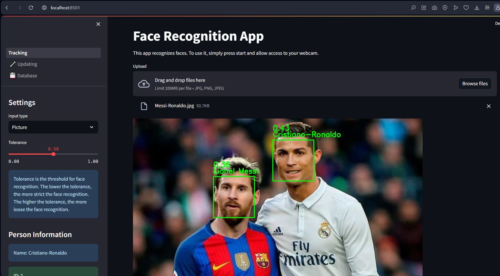
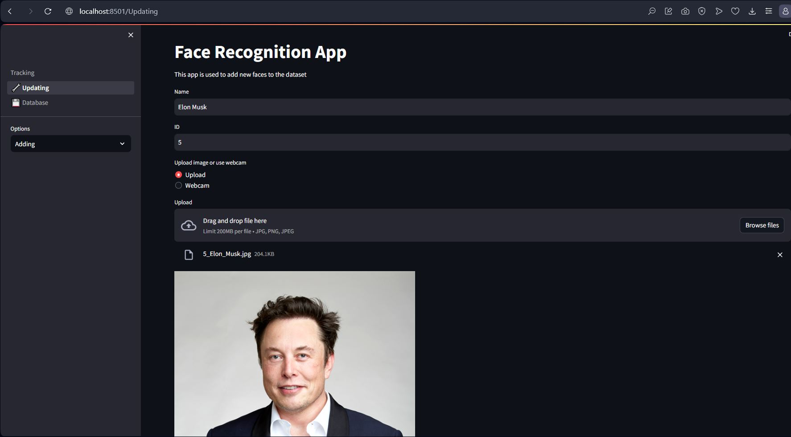
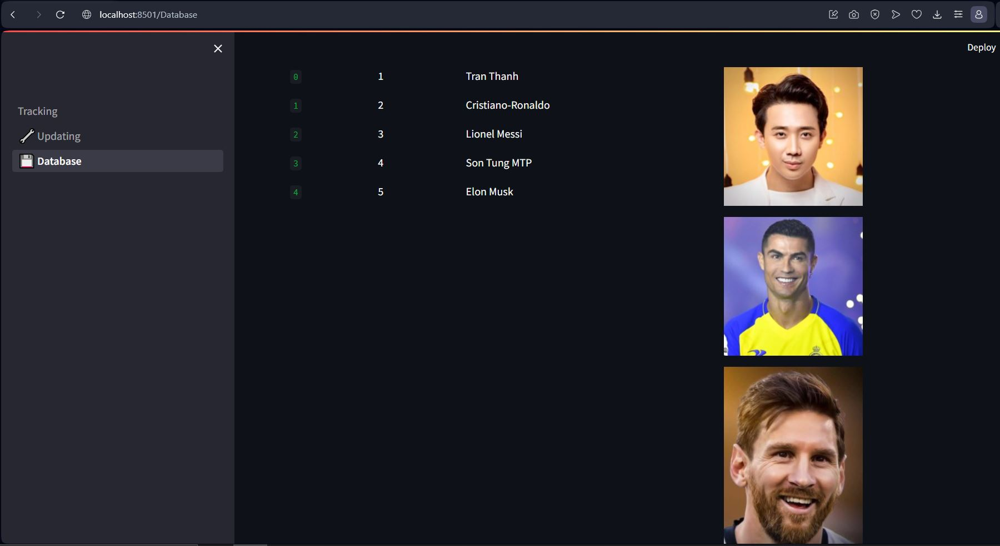

# Face recognition app using Streamlit

This is a face recognition application built using Python, [Face-Recognition API](https://github.com/ageitgey/face_recognition) and Streamlit framework. The app allows users to upload an image containing faces and performs face recognition.

## Features

- Face detection and recognition
- Multi-face recognition
- Option to display recognized faces

## Repository structure
```bash
├───dataset
│   │───ID_Name.jpg
│   │───...
├───pages
│   ├───1_🔧_Updating.py
│   └───2_💾_Database
├───results
│   │───result.JPG
│   │───...
├───Tracking.py
│───utils.py
├───config.yaml 
└───README.md
```

## Description
- **dataset**: contains images of people to be recognized. The file name format is ID_Name.jpg. `For example, 1_Tran_Thanh.jpg, 2_Cristiano_Ronaldo.jpg, etc.` It is freely to use jpg, jpeg or png format.
- **pages**: contains the code for each page of the app. If you want to add more pages, you can create a new file which format is `Order_Icon_Pagename` in this folder, or just no-icon page with format `Order_Pagename`.
- **Tracking.py**: home page of the app, using for tracking real-time using webcam and picture.
- **utils.py**: contains the functions utilized by the app.
- **config.yaml**: contains the configuration for the app such as path of dataset dir and prompt messages.


## Installation
1. Clone the repository
```bash
git clone https://github.com/quan131/Face_Recognition_Using_Streamlit.git
cd Face_Recognition_Using_Streamlit
```

2. Run the app
```bash
streamlit run Tracking.py
```

## Usage
1. Tracking real-time using webcam 
2. Tracking using a image file 
3. Updating database (adding, deleting and updating)
4. Viewing the database


## Demo

1.  Tracking using webcam

 

2. Tracking using picture 


- Multi-face recognition



3. Adding new person to database



4. Viewing the database

